# Multi-User Schema Documentation

**Status:** Phase 1 complete (DDL)

**Overview:** The Quarry database is a SQLite database with foreign key enforcement (`PRAGMA foreign_keys = ON`). It separates canonical shared data (companies, job postings, locations) from per-user preferences and scores (labels, status, similarity, enrichment, settings). This enables multiple users to independently rate and manage the same job postings.

---

## Entity-Relationship Diagram

```mermaid
erDiagram
    companies {
        int id PK
        text name
        text domain
        text careers_url
        text ats_type "CHECK(unknown,greenhouse,lever,ashby,generic)"
        text ats_slug
        text resolve_status "CHECK(unresolved,resolved,failed)"
        int resolve_attempts
        timestamp created_at
        timestamp updated_at
    }

    job_postings {
        int id PK
        int company_id FK "NOT NULL"
        text title
        text title_hash
        text url
        text description
        text location
        text work_model
        timestamp posted_at
        text source_id
        text source_type
        blob embedding
        timestamp first_seen_at
        timestamp last_seen_at
    }

    locations {
        int id PK
        text canonical_name UK
        text city
        text state
        text state_code
        text country
        text country_code
        text region
        real latitude
        real longitude
        text resolution_status
        text raw_fragment
    }

    job_posting_locations {
        int posting_id PK_FK
        int location_id PK_FK
    }

    crawl_runs {
        int id PK
        int company_id FK
        timestamp started_at
        timestamp completed_at
        text status
        int postings_found
        int postings_new
        text error_message
    }

    classifier_versions {
        int id PK
        timestamp trained_at
        int training_samples
        int positive_samples
        int negative_samples
        real cv_accuracy
        real cv_precision
        real cv_recall
        text model_path
        boolean active
        text notes
    }

    agent_actions {
        int id PK
        text run_id
        text tool_name
        text tool_args
        text tool_result
        text rationale
        timestamp created_at
    }

    system_settings {
        text key PK
        text value
        timestamp updated_at
    }

    users {
        int id PK
        text email UK
        text name
        boolean is_active
        timestamp created_at
        timestamp updated_at
    }

    user_watchlist {
        int id PK
        int user_id FK
        int company_id FK
        boolean active
        int crawl_priority
        text notes
        text added_reason
        timestamp created_at
        timestamp updated_at
    }

    user_posting_status {
        int id PK
        int user_id FK
        int posting_id FK
        text status "CHECK(new,seen,applied,rejected,archived)"
        timestamp first_seen_at
        timestamp last_seen_at
    }

    user_labels {
        int id PK
        int user_id FK
        int posting_id FK
        text signal "CHECK(positive,negative,applied,skip)"
        text notes
        timestamp labeled_at
        text label_source
    }

    user_search_queries {
        int id PK
        int user_id FK
        text query_text
        text site
        boolean active
        text added_reason
        text retired_reason
        int postings_found
        int positive_labels
        timestamp created_at
        timestamp updated_at
    }

    user_similarity_scores {
        int id PK
        int user_id FK
        int posting_id FK
        real similarity_score
        timestamp computed_at
    }

    user_classifier_scores {
        int id PK
        int user_id FK
        int posting_id FK
        real classifier_score
        int model_version_id FK "SET NULL"
        timestamp computed_at
    }

    user_enriched_postings {
        int id PK
        int user_id FK
        int posting_id FK
        int fit_score
        text role_tier
        text fit_reason
        text key_requirements
        timestamp enriched_at
    }

    user_settings {
        int id PK
        int user_id FK
        text key
        text value
        timestamp updated_at
    }

    %% Shared catalog relationships
    companies ||--o{ job_postings : "has (CASCADE)"
    companies ||--o{ crawl_runs : "has (CASCADE)"
    companies ||--o{ user_watchlist : "watched by"
    job_postings ||--o{ job_posting_locations : "located at"
    locations ||--o{ job_posting_locations : "used by"
    classifier_versions ||--o{ user_classifier_scores : "trained (SET NULL)"

    %% Per-user relationships
    users ||--o{ user_watchlist : "manages (CASCADE)"
    users ||--o{ user_posting_status : "has (CASCADE)"
    users ||--o{ user_labels : "rates (CASCADE)"
    users ||--o{ user_search_queries : "defines (CASCADE)"
    users ||--o{ user_similarity_scores : "has (CASCADE)"
    users ||--o{ user_classifier_scores : "has (CASCADE)"
    users ||--o{ user_enriched_postings : "has (CASCADE)"
    users ||--o{ user_settings : "configures (CASCADE)"

    job_postings ||--o{ user_posting_status : "tracked (CASCADE)"
    job_postings ||--o{ user_labels : "rated (CASCADE)"
    job_postings ||--o{ user_similarity_scores : "scored (CASCADE)"
    job_postings ||--o{ user_classifier_scores : "scored (CASCADE)"
    job_postings ||--o{ user_enriched_postings : "enriched (CASCADE)"
```



---

## Table Groups

### Shared Catalog Tables

These tables hold canonical, user-independent data. All job postings are stored once regardless of how many users are interested.

| Table                   | Description                    | Key Constraints                                         |
| ----------------------- | ------------------------------ | ------------------------------------------------------- |
| `companies`             | Company directory              | Name required; `UNIQUE` implied by PK only              |
| `job_postings`          | Job posting catalog            | `UNIQUE(company_id, title_hash)`; `company_id NOT NULL` |
| `locations`             | Geo data                       | `canonical_name UNIQUE`                                 |
| `job_posting_locations` | Junction: postings ↔ locations | Composite PK `(posting_id, location_id)`                |
| `crawl_runs`            | System-level crawl history     | FK to `companies` (CASCADE)                             |
| `classifier_versions`   | Trained ML models              | —                                                       |
| `agent_actions`         | System-level agent log         | —                                                       |
| `system_settings`       | Global configuration           | Key-value store                                         |

### Per-User Tables

These tables all have a `user_id` column with `REFERENCES users(id) ON DELETE CASCADE`. Deleting a user removes all their data. Deleting a company or posting cascades to per-user data as well.

| Table                    | Description                                   | Key Constraints                                            |
| ------------------------ | --------------------------------------------- | ---------------------------------------------------------- |
| `users`                  | User accounts                                 | `email UNIQUE`; default user id=1 seeded                   |
| `user_watchlist`         | Which companies each user tracks              | `UNIQUE(user_id, company_id)`                              |
| `user_posting_status`    | Per-user seen/applied/rejected/archived state | `UNIQUE(user_id, posting_id)`                              |
| `user_labels`            | Per-user positive/negative ratings ★          | `UNIQUE(user_id, posting_id, signal)`                      |
| `user_search_queries`    | Per-user job board search queries             | `UNIQUE(user_id, query_text)`                              |
| `user_similarity_scores` | Per-user embedding similarity scores          | `UNIQUE(user_id, posting_id)`                              |
| `user_classifier_scores` | Per-user ML classifier scores                 | `UNIQUE(user_id, posting_id)`; `model_version_id SET NULL` |
| `user_enriched_postings` | Per-user LLM enrichment                       | `UNIQUE(user_id, posting_id)`                              |
| `user_settings`          | Per-user configuration                        | `UNIQUE(user_id, key)`                                     |

---

## Foreign Key Cascade Behavior

All foreign keys use `ON DELETE CASCADE` except one:

| From                     | To                    | On Delete    | Rationale                                           |
| ------------------------ | --------------------- | ------------ | --------------------------------------------------- |
| `job_postings`           | `companies`           | CASCADE      | Deleting a company removes its postings             |
| `job_posting_locations`  | `job_postings`        | CASCADE      | Removing a posting removes its location links       |
| `job_posting_locations`  | `locations`           | CASCADE      | —                                                   |
| `crawl_runs`             | `companies`           | CASCADE      | —                                                   |
| All per-user tables      | `users`               | CASCADE      | Deleting a user cleans up all their data            |
| All per-user tables      | `job_postings`        | CASCADE      | Deleting a posting cleans up per-user data          |
| `user_watchlist`         | `companies`           | CASCADE      | Deleting a company removes watchlist entries        |
| `user_classifier_scores` | `classifier_versions` | **SET NULL** | Scores survive model deletion, just lose provenance |

---

## Key Design Decisions

### 1. Per-User Labels (★)

The most critical change. `user_labels` replaces the old global `labels` table. The composite key `UNIQUE(user_id, posting_id, signal)` means:

- User A and User B can independently rate the same posting (positive vs negative)
- A single user can have multiple signal types on the same posting (`positive` + `applied`)
- A single user cannot have two `positive` labels on the same posting (prevents double-positive bugs)

### 2. Per-User Similarity Scores

Different users have different ideal role descriptions, so embedding similarity scores differ per user. The `user_similarity_scores` table stores these independently.

### 3. Per-User Enrichment

LLM enrichment ("is this a good fit for me?") is inherently per-user. `user_enriched_postings` stores `fit_score`, `role_tier`, `fit_reason`, and `key_requirements` per user.

### 4. Per-User Posting Status

`user_posting_status` replaces the old `job_postings.status` column. User A marking a posting as "applied" does not affect User B's view of that posting.

### 5. Default User for Single-User Mode

Until authentication is implemented, all operations default to `user_id=1`. The seed `INSERT OR IGNORE INTO users (id, email, name) VALUES (1, 'default@local', 'Default User')` runs on every `init_db()` call.

### 6. System vs User Settings Split

The old `settings` table is split into:

- `system_settings` — schema version, system-wide configuration
- `user_settings` — per-user configuration (ideal role description, similarity thresholds, filter config)

---

## Data Migration from Old Schema

The old `quarry.db` schema had a single-user design with user-specific columns embedded in shared tables:

| Old Location                    | New Location                        | Notes                    |
| ------------------------------- | ----------------------------------- | ------------------------ |
| `companies.active`              | `user_watchlist.active`             | Per-user toggle          |
| `companies.crawl_priority`      | `user_watchlist.crawl_priority`     | Per-user prioritization  |
| `companies.notes`               | `user_watchlist.notes`              | Per-user private notes   |
| `companies.added_by`            | Removed                             | Replaced by `user_id` FK |
| `companies.added_reason`        | `user_watchlist.added_reason`       | Per-user context         |
| `companies.last_crawled_at`     | Removed                             | In `crawl_runs`          |
| `job_postings.similarity_score` | `user_similarity_scores`            | Per-user ideal role      |
| `job_postings.classifier_score` | `user_classifier_scores`            | Per-user classifier      |
| `job_postings.fit_score`        | `user_enriched_postings`            | Per-user LLM enrichment  |
| `job_postings.role_tier`        | `user_enriched_postings`            | Per-user LLM enrichment  |
| `job_postings.fit_reason`       | `user_enriched_postings`            | Per-user LLM enrichment  |
| `job_postings.key_requirements` | `user_enriched_postings`            | Per-user LLM enrichment  |
| `job_postings.enriched_at`      | `user_enriched_postings`            | Per-user LLM enrichment  |
| `job_postings.status`           | `user_posting_status`               | Per-user state           |
| `labels` (table)                | `user_labels`                       | Per-user ratings         |
| `search_queries` (table)        | `user_search_queries`               | Per-user searches        |
| `search_queries.added_by`       | Removed                             | Replaced by `user_id` FK |
| `settings` (table)              | `system_settings` + `user_settings` | System vs per-user split |

There is **no automatic migration** from the old schema. The old `quarry.db` is deleted and a new one is created. In single-user mode, re-seeding and re-crawling is required.

---

## Verification

```bash
# Initialize new DB
python -m quarry.store init

# Run schema tests (28 tests)
python -m pytest tests/test_db.py -v

# Inspect schema
sqlite3 quarry.db ".tables"
sqlite3 quarry.db ".schema user_labels"
sqlite3 quarry.db "SELECT id, email, name FROM users"
```
